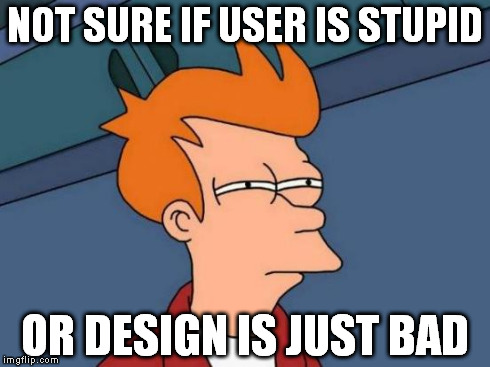
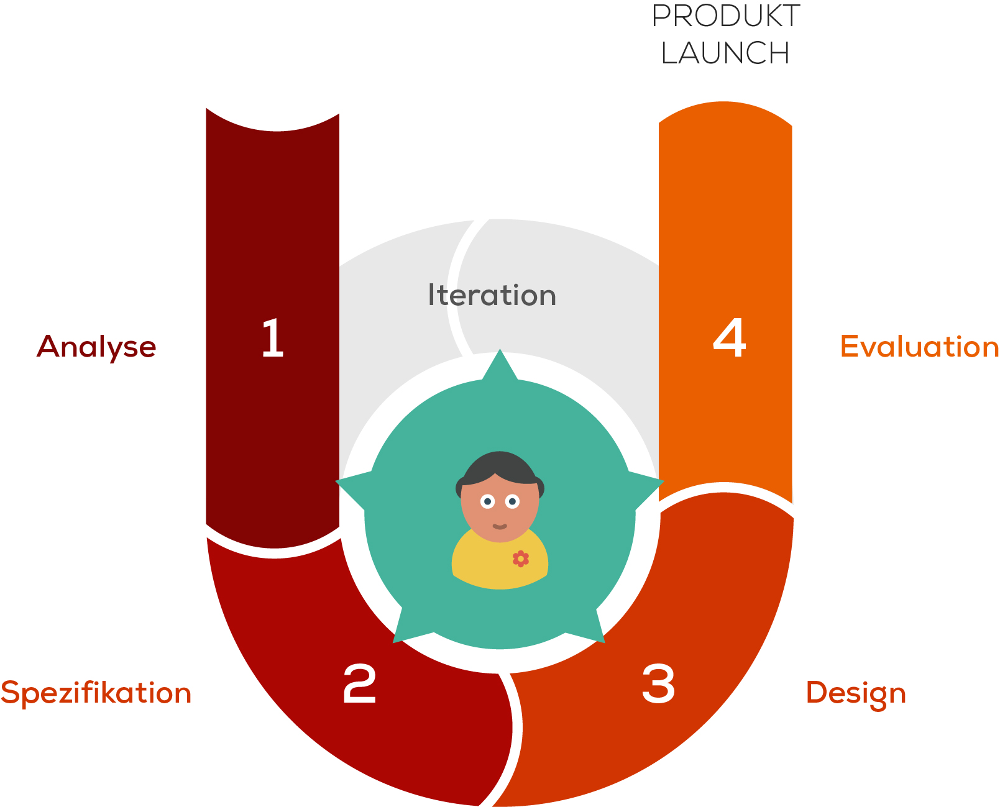
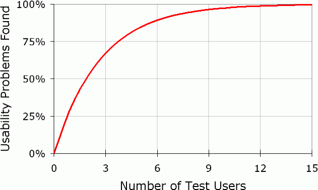

# Prozesszyklus

Es gibt nicht __den__ Projektzyklus für die Umsetzung eines Webprojektes. Insgesamt gibt es eine Vielzahl von unterschiedlichen Variaten mit Vor- und Nachteilen. Im Folgenden schauen wir uns den UCD-Prozess (User Centred Design) genauer an.

## «User Centred Design»-Prozess

> User centered design is an approach to interactive system development that focuses specifically on making systems usable. It is a multi-disciplinary activity.

Definition gemäss ISO 13407 (1999).

### Ziele von UCD

Der Grund um mit der Methode des User Centred Design zu arbeiten ist es, eine benutzerfreundliche Oberfläche zu gestalten. Dabei stehen nicht technologische oder designtechnische Aspekte im Vordergrund, sondern die Benutzerfreundlichkeit.

> Ein benutzerfreundliche Oberfläche ist einfach zu lernen, intuitiv bedienbar, unterstützt die Aufgaben und Ziele des Benutzers effektiv und effizient und ist motivierend und kurzweilig zum Bedienen.

Freie Übersetzung von [www.usabilityfirst.com](www.usabilityfirst.com)

### Merkmale des UCD

Folgende drei verkürzten Charakteristiken geben über die Grundsätze des UCD-Prozess Auskunft:

* Frühe Fokussierung auf die Zielgruppe und deren Aufgaben.
* Systematisches Testing der Oberfläche bei der Zielgruppe und empirische Überprüfung.
* Das Design wird iterativ erarbeitet und stetig angepasst.

### Vorgehen in einem UCD-Prozess

#### 1. Analyse

Im ersten Schritt des UCD-Prozess geht es darum, den Nutzer zu analysieren. Ziel ist es, ein möglichst genaues Bild dieser Personengruppe zu erstellen. So können die nachfolgenden Schritte optimal danach ausgerichtet werden.

TIPP: Eine sinnvolle Methode ist die Erstellung von Personas anhand der folgenden Fragestellungen

__Nutzer__ - Wer sind unsere User?

* Wie alt sind unsere Nutzer?
* Welches Geschlecht hat der typische Nutzer?
* Welche Kenntnisse hat der typische Nutzer?
* ...

__Nutzerverhalten__ - Wie verhalten sich unere Nutzer?

* Wo ist unser Nutzer überall angemeldet?
* Wie viel sind die Nutzer am Computer?
* Was für Hobbies haben unsere Nutzer?
* ...

__Nutzeraufgaben__ - Wie arbeitet unser Nutzer?

* Welche Aufgaben muss der Nutzer erfüllen?
* Wie tritt der Nutzer mit dem Produkt in Kontakt?
* ...

#### 2. Spezifikationen

Nachdem wir den Nutzer für das Produkt definiert haben, müssen wir dies mit den restlichen Rahmenbedingungen in den Spezifikationen zusammentragen. Das Ziel ist es, ein Projektdokument mit sämtlichen relevanten Informationen zu erstellen. 

Mögliche Inhalte dafür sind:

__Spezifikation des Nutzers__

Dabei werden die Erkenntnisse aus der Analyse genommen.

__Spezifikation der Oberfläche__

Platzierung der Funktionen, Reihenfolge der einzelnen Funktionen/Module - Oft wird dies anhand eines Prototyps oder eines Blueprints umgesetzt.

__Spezifikaiton der Gestaltung__

In diesem Schritt werden die gestalterischen Voraussetzungen beispielsweise aus dem CICD dokumentiert.

#### 3. Design

In diesem Schritt des Prozesses wird das Designkonzept erarbieten. Die Umsetzung erfolgt dabei meistens in mehreren Schritten, von der einfachen Skizze bis zum kompletten Design.

Bereits hier wird der Kunde beziehungsweise der Nutzer permanent miteinbezogen (UCD).

#### 4. Evaluierung

In diesem Schritt wird das Produkt getestet, dies im besten Fall immer mit den effektiven Nutzern der Website. 

Die Ergebnisse aus den Tests fliessen wiederum zurück in den Design-Prozess und das Produkt wird dementsprechend angepasst.

TIPP: Mit 6 bis 9 Testusern erhält man bereits 90 % der Usability Problemen.

#### 5. Produkt Launch

Das Produkt wird veröffentlicht, das Testing und die Anpassungen sind jedoch keineswegs abgeschlossen.

### Die wichtigsten Werkzeuge

##### Fragen, fragen, fragen...
Was? Wann? Warum? Wo? Wie? Wer? 

##### Normaler Menschenverstand
Das UCD ist ein abgeschlossenes Model, sondern nur eine Konzeptvorlage. Wie das Konzept genau umgesetzt wird, liegt in der Hand des Anwenders!

Praxisbezogene Umsetzung: [Ein Beispiel aus der Praxis.](http://www.mprove.de/script/00/upa/_media/upaposter_85x11.pdf)